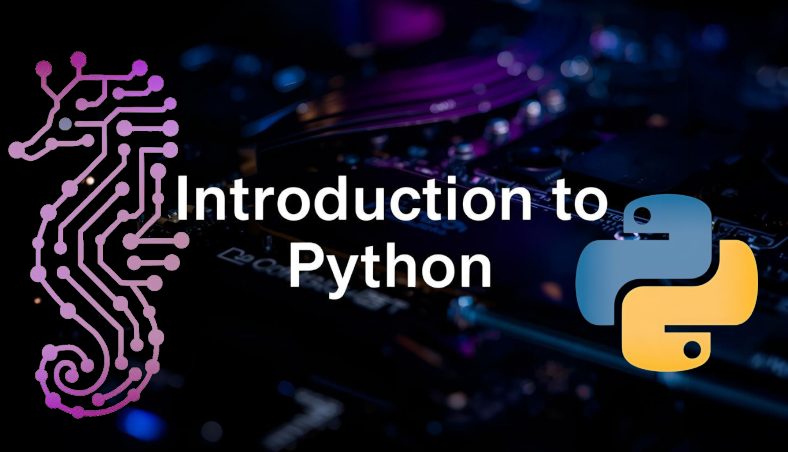

# Introduction to Python 🐍

<p align="center">
    
</p>

This repository is a comprehensive collection of Python projects, meticulously crafted to build a strong foundation in core programming concepts. Each project focuses on specific areas, from fundamental data structures and control flow to advanced topics like modules, exceptions, and data structures.

## 📚 Project Overview

This project serves as a structured learning path through various essential Python topics. You'll find a progression from basic syntax and operations to more complex programming paradigms.

## 🎯 Learning Objectives

Upon completion of these projects, you will be able to:

- Understand and implement fundamental Python concepts, including data types, control flow, and functions.
- Effectively utilize various data structures like lists, tuples, sets, and dictionaries.
- Master exception handling for robust and error-resilient code.
- Organize code using modules and manage command-line arguments for dynamic scripting.
- Write clean, efficient, and well-documented Python code adhering to best practices.

## ⚙️ General Requirements

All projects within this repository adhere to the following general requirements:

| Requirement      | Details                                         |
|------------------|------------------------------------------------|
| Allowed editors  | vi, vim, emacs                                  |
| Environment      | Ubuntu 20.04 LTS with Python 3.8.x              |
| File format      | All files must end with a new line.             |
| Shebang          | First line of all files: `#!/usr/bin/python3`   |
| README           | A README.md file at the root of each project folder is mandatory. |
| Style            | Code must use pycodestyle (version 2.7.*)       |
| Permissions      | All files must be executable.                   |
| File Length      | File length will be tested using `wc`.          |

## 📂 Projects

Here's a breakdown of the projects included, in order:

```markdown
[
    "[🐍 Python - Hello World 🌟](https://github.com/Schpser/holbertonschool-higher_level_programming/tree/main/python-hello_world)\n\nProject Description: Introduces the fundamental concepts of printing text and variables, string manipulation, indexing, and slicing. It emphasizes adhering to the PEP 8 style guide.",
    "[🐍 Python: If/Else, Loops, and Functions 🚀](https://github.com/Schpser/holbertonschool-higher_level_programming/tree/main/python-if_else_loops_function)\n\nProject Description: Focuses on building a solid foundation in Python, covering control flow statements (if, else, for, while), function definition, variable scope, and debugging.",
    "[🐍 Python: Modules and Command Line Arguments 📦](https://github.com/Schpser/holbertonschool-higher_level_programming/tree/main/python-import_modules)\n\nProject Description: Explores Python's modularity, enabling you to organize code, import functions and modules, create your own modules, and handle command-line arguments.",
    "[🐍 Python - Data Structures: Lists, Tuples 🗂️](https://github.com/Schpser/holbertonschool-higher_level_programming/tree/main/python-data_structures)\n\nProject Description: Focuses on Python's core data structures: lists and tuples. Exercises cover creation, manipulation, and effective use, including slicing, list comprehensions, and sequence unpacking.",
    "[🐍 Python - More Data Structures 📊](https://github.com/Schpser/holbertonschool-higher_level_programming/tree/main/python-more_data_structures)\n\nProject Description: Delves into more advanced data structures like sets and dictionaries, and introduces functional programming concepts like lambda functions, map, reduce, and filter.",
    "[🐍 Python Exceptions ⚠️](https://github.com/Schpser/holbertonschool-higher_level_programming/tree/main/python-exceptions)\n\nProject Description: Focuses on understanding and implementing exception handling in Python. You'll learn to differentiate between errors and exceptions, use try, except, and finally blocks, and raise built-in exceptions.",
    "[Python Test Driven Development Project 🧪](https://github.com/Schpser/holbertonschool-higher_level_programming/tree/main/python-test_driven_development)\n\nProject Description: This project focuses on writing Python code using the Test-Driven Development (TDD) methodology. It includes modules for common operations and corresponding unit tests."
]
```

## 🚀 Getting Started

To run any of the scripts, follow these steps:

### Make Scripts Executable

```bash
chmod +x *.py
```

### Run a Specific Task File

```bash
./<task_file_name>.py
```
