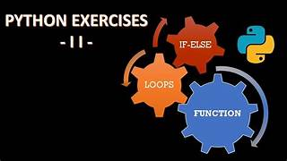

# 🐍 Python: If/Else, Loops, and Functions

Welcome to a series of exercises designed to build a solid foundation in Python programming. This project focuses on core concepts like control flow, loops, and functions.

---

## 🎯 Goals & Learning Objectives

- **Master Control Flow:**  
    Understand and effectively use `if`, `if...else`, `for`, and `while` statements.

- **Define Functions:**  
    Learn how to create and use functions, including the `return` statement.

- **Understand Key Concepts:**  
    Grasp the importance of indentation, variable scope, and how to debug with tracebacks.

- **Work with Data:**  
    Practice using arithmetic operators and formatted string output.

---

## 💻 Project Details

| Detail        | Description                                                      |
|-------------- |------------------------------------------------------------------|
| **Version**   | All files are interpreted on Ubuntu 20.04 LTS using Python 3.8.x |
| **Code Style**| All code must conform to the `pycodestyle` standard (v2.7.x)     |
| **Execution** | Files must be executable.<br>To make a file executable, run:<br>`chmod u+x <filename>` |

---

<!DOCTYPE html>
<html lang="fr">
<head>
    <meta charset="UTF-8">
    <meta name="viewport" content="width=device-width, initial-scale=1.0">
    <title>Projet Python - Tâches</title>
    <!-- On charge le framework Tailwind CSS pour le style -->
    <script src="https://cdn.tailwindcss.com"></script>
    <style>
        body {
            font-family: 'Inter', sans-serif;
        }
    </style>
</head>
<body class="bg-gray-900 text-gray-200 min-h-screen flex flex-col items-center justify-center p-4">
    <div class="w-full max-w-2xl bg-gray-800 p-8 rounded-xl shadow-2xl border border-gray-700">
        <h1 class="text-3xl font-bold text-center mb-6 text-yellow-400">Tasks 🐍</h1>
        <p class="text-center text-sm text-gray-400 mb-8">
            Click to open a file
        </p>
        <ul class="space-y-4">
            <li class="p-4 bg-gray-700 rounded-lg transition-transform transform hover:scale-105">
                <a href="https://github.com/Schpser/holbertonschool-higher_level_programming/blob/main/python-if_else_loops_functions/0-positive_or_negative.py" class="text-lg text-blue-400 hover:underline">
                    1. Positive anything is better than negative nothing
                </a>
            </li>
            <li class="p-4 bg-gray-700 rounded-lg transition-transform transform hover:scale-105">
                <a href="https://github.com/Schpser/holbertonschool-higher_level_programming/blob/main/python-if_else_loops_functions/1-last_digit.py" class="text-lg text-blue-400 hover:underline">
                    2. The last digit
                </a>
            </li>
            <li class="p-4 bg-gray-700 rounded-lg transition-transform transform hover:scale-105">
                <a href="https://github.com/Schpser/holbertonschool-higher_level_programming/blob/main/python-if_else_loops_functions/2-print_alphabet.py" class="text-lg text-blue-400 hover:underline">
                    3. I sometimes suffer from insomnia...
                </a>
            </li>
            <li class="p-4 bg-gray-700 rounded-lg transition-transform transform hover:scale-105">
                <a href="https://github.com/Schpser/holbertonschool-higher_level_programming/blob/main/python-if_else_loops_functions/3-print_alphabt.py" class="text-lg text-blue-400 hover:underline">
                    4. When I was having that alphabet soup...
                </a>
            </li>
            <li class="p-4 bg-gray-700 rounded-lg transition-transform transform hover:scale-105">
                <a href="https://github.com/Schpser/holbertonschool-higher_level_programming/blob/main/python-if_else_loops_functions/4-print_hexa.py" class="text-lg text-blue-400 hover:underline">
                    5. Hexadecimal printing
                </a>
            </li>
            <li class="p-4 bg-gray-700 rounded-lg transition-transform transform hover:scale-105">
                <a href="https://github.com/Schpser/holbertonschool-higher_level_programming/blob/main/python-if_else_loops_functions/5-print_comb2.py" class="text-lg text-blue-400 hover:underline">
                    6. 00...99
                </a>
            </li>
            <li class="p-4 bg-gray-700 rounded-lg transition-transform transform hover:scale-105">
                <a href="https://github.com/Schpser/holbertonschool-higher_level_programming/blob/main/python-if_else_loops_functions/6-print_comb3.py" class="text-lg text-blue-400 hover:underline">
                    7. Inventing is a combination of brains...
                </a>
            </li>
            <li class="p-4 bg-gray-700 rounded-lg transition-transform transform hover:scale-105">
                <a href="https://github.com/Schpser/holbertonschool-higher_level_programming/blob/main/python-if_else_loops_functions/7-islower.py" class="text-lg text-blue-400 hover:underline">
                    8. islower
                </a>
            </li>
            <li class="p-4 bg-gray-700 rounded-lg transition-transform transform hover:scale-105">
                <a href="https://github.com/Schpser/holbertonschool-higher_level_programming/blob/main/python-if_else_loops_functions/8-uppercase.py" class="text-lg text-blue-400 hover:underline">
                    9. To uppercase
                </a>
            </li>
            <li class="p-4 bg-gray-700 rounded-lg transition-transform transform hover:scale-105">
                <a href="https://github.com/Schpser/holbertonschool-higher_level_programming/blob/main/python-if_else_loops_functions/9-print_last_digit.py" class="text-lg text-blue-400 hover:underline">
                    10. There are only 3 colors...
                </a>
            </li>
            <li class="p-4 bg-gray-700 rounded-lg transition-transform transform hover:scale-105">
                <a href="https://github.com/Schpser/holbertonschool-higher_level_programming/blob/main/python-if_else_loops_functions/10-add.py" class="text-lg text-blue-400 hover:underline">
                    11. a + b
                </a>
            </li>
            <li class="p-4 bg-gray-700 rounded-lg transition-transform transform hover:scale-105">
                <a href="https://github.com/Schpser/holbertonschool-higher_level_programming/blob/main/python-if_else_loops_functions/11-pow.py" class="text-lg text-blue-400 hover:underline">
                    12. a ^ b
                </a>
            </li>
            <li class="p-4 bg-gray-700 rounded-lg transition-transform transform hover:scale-105">
                <a href="https://github.com/Schpser/holbertonschool-higher_level_programming/blob/main/python-if_else_loops_functions/12-fizzbuzz.py" class="text-lg text-blue-400 hover:underline">
                    13. Fizz Buzz
                </a>
            </li>
        </ul>
    </div>

</body>
</html>
```
