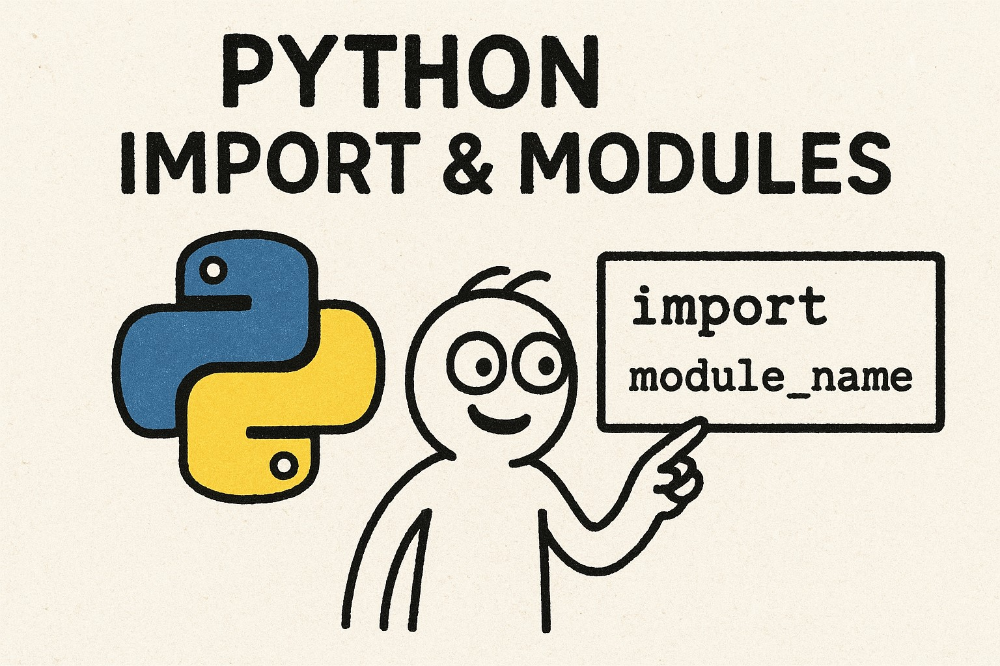

# Python: Modules and Command Line Arguments 📦

## Overview

This project is a series of practical exercises designed to familiarize you with the concept of modularity in Python. You will learn how to organize your code, use external modules, and manage command-line arguments to make your scripts more versatile.

---

## 🧠 Learning Objectives

At the end of this project, you should be able to explain the following points:

- **The importance of modules:** Why Python programming is awesome and how to organize your code.
- **Importing:** How to import functions and modules from other files.
- **Modules:** How to create your own module.
- **Built-in tools:** How to use the `dir()` function.
- **Conditional execution:** How to prevent code in your script from being executed when imported.
- **Command-line arguments:** How to use command-line arguments with your Python programs.

---

## 💻 Project Requirements

| Requirement                | Details                                                                 |
|----------------------------|-------------------------------------------------------------------------|
| **Allowed editors**        | `vi`, `vim`, `emacs`                                                    |
| **System**                 | Ubuntu 22.04 LTS, Python 3 (version 3.10.x)                             |
| **File format**            | All files should end with a new line and start with `#!/usr/bin/python3` |
| **Style**                  | Respect `pycodestyle` (version 2.7.x)                                   |
| **Execution**              | All files must be executable                                            |

---

## 🐍 Tasks

| # | Task Title                                   | File Link                                                                 |
|---|----------------------------------------------|--------------------------------------------------------------------------|
| 0 | Import a simple function from a simple file  | [0-add.py](https://github.com/Schpser/holbertonschool-higher_level_programming/blob/main/python-import_modules/0-add.py) |
| 1 | My first toolbox!                            | [1-calculation.py](https://github.com/Schpser/holbertonschool-higher_level_programming/blob/main/python-import_modules/1-calculation.py) |
| 2 | How to make a script dynamic!                | [2-args.py](https://github.com/Schpser/holbertonschool-higher_level_programming/blob/main/python-import_modules/2-args.py) |
| 3 | Infinite addition                           | [3-infinite_add.py](https://github.com/Schpser/holbertonschool-higher_level_programming/blob/main/python-import_modules/3-infinite_add.py) |
| 4 | Who are you?                                | [4-who_are_you.py](https://github.com/Schpser/holbertonschool-higher_level_programming/blob/main/python-import_modules/4-who_are_you.py) |
| 5 | Everything can be imported                  | [5-everything_can_be_imported.py](https://github.com/Schpser/holbertonschool-higher_level_programming/blob/main/python-import_modules/5-everything_can_be_imported.py) |

---

### _Tip: Use different heading levels for clarity. You can style text with bold or italics for emphasis._
